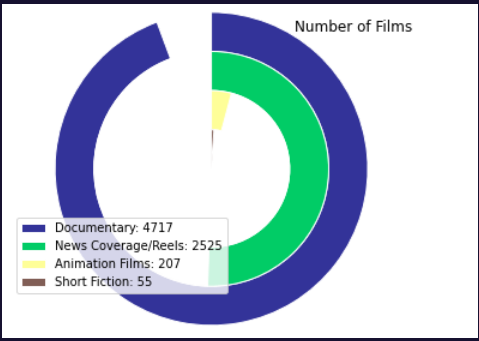

# Visualization-of-Indian-Film-Divisions

This repository explores the data file provided by https://web.sas.upenn.edu/bollywood-and-beyond/films-division-data/. The data maintains a record of the social, political and cultural imaginations and realities of Indian Cinema since 1948.

